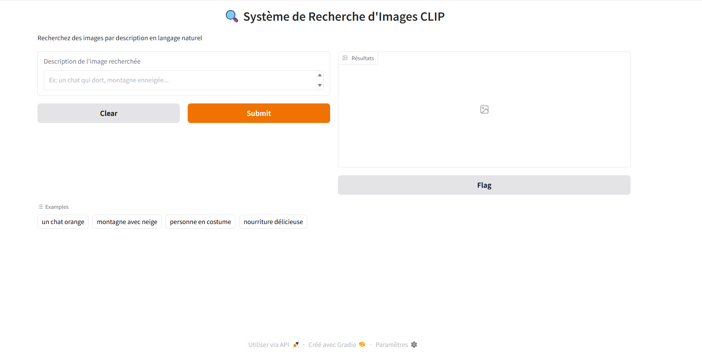
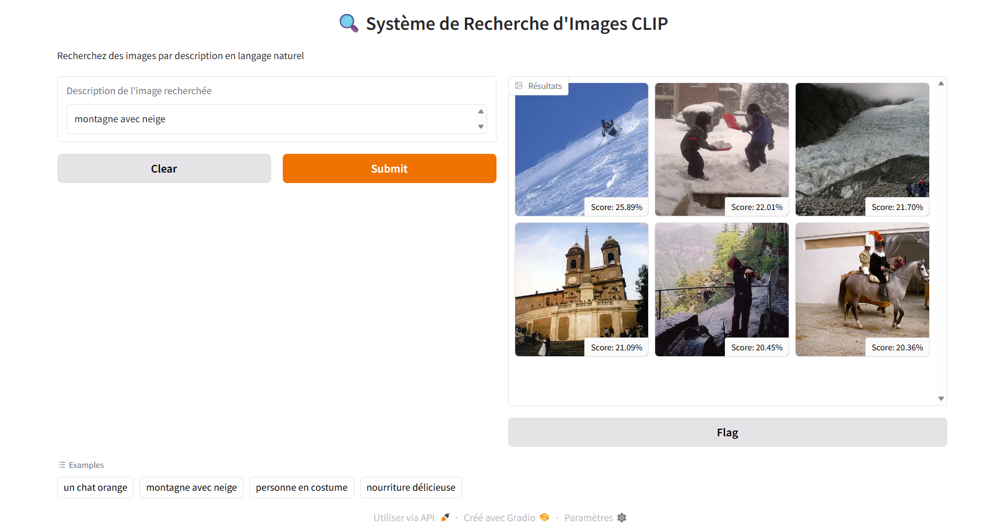
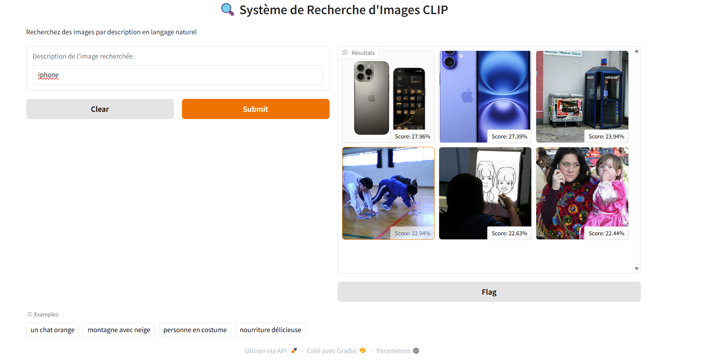
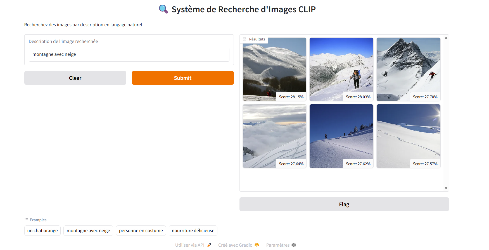
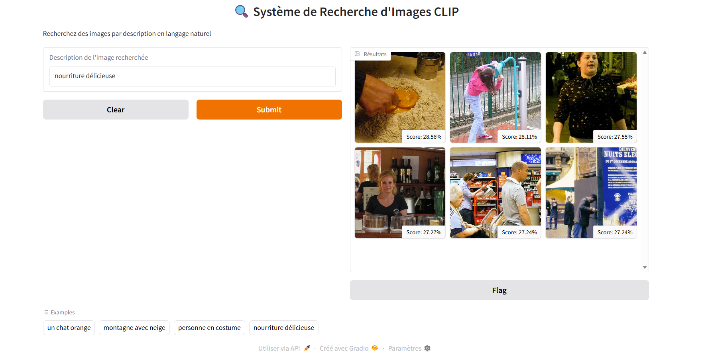

# 🔍 Système de Recherche d'Images par Description Textuelle (CLIP)

[](https://www.python.org/downloads/)
[](https://pytorch.org/)
[](LICENSE)
[](https://huggingface.co/transformers/)

Un système intelligent de recherche d'images utilisant le modèle **CLIP (Contrastive Language-Image Pre-training)** d'OpenAI. Recherchez des images dans votre dataset en utilisant simplement des descriptions en langage naturel !



## ✨ Fonctionnalités

- 🎯 **Recherche sémantique** : Trouvez des images par description naturelle
- 🌍 **Multilingue** : Supporte plusieurs langues (français, anglais, etc.)
- ⚡ **Rapide** : Recherche en temps réel sur des milliers d'images
- 🎨 **Interface intuitive** : Application web interactive avec Gradio
- 💾 **Indexation persistante** : Sauvegarde des embeddings pour réutilisation
- 🔧 **Personnalisable** : Facile à adapter à vos besoins spécifiques

## 🎬 Démo



```bash
Requête : "nature"
Résultats : 5 images du nature correspondant à la description avec scores de similarité
```

**Exemples de requêtes supportées :**
- "un chat orange"



- "montagne avec neige"



- "nourriture délicieuse"
  



## 📋 Prérequis

- **Python** : Version 3.8 ou supérieure
- **Système d'exploitation** : Windows, Linux ou macOS
- **RAM** : Minimum 4 GB (8 GB recommandé)
- **GPU** : Optionnel (CUDA compatible) pour accélération

## 🚀 Installation

### 1. Cloner le repository

```bash
git clone https://github.com/votre-username/clip-image-search.git
cd clip-image-search
```

### 2. Créer un environnement virtuel

**Windows :**
```bash
python -m venv venv
venv\Scripts\activate
```

**Linux/Mac :**
```bash
python3 -m venv venv
source venv/bin/activate
```

### 3. Installer les dépendances

```bash
pip install -r requirements.txt
```

### 4. Télécharger le dataset de test (optionnel)

```bash
python telecharger_images_test.py
```

Ou ajoutez vos propres images dans le dossier `dataset_images/`.

## 📦 Structure du Projet

```
clip-image-search/
│
├── venv/                           # Environnement virtuel
├── dataset_images/                 # Dossier contenant vos images
│   ├── image1.jpg
│   ├── image2.jpg
│   └── ...
│
├── image_search.py                 # Module principal CLIP
├── app.py                          # Interface web Gradio
├── telecharger_images_test.py      # Script de téléchargement d'images
├── requirements.txt                # Dépendances Python
├── image_index.pkl                 # Index des embeddings (généré automatiquement)
├── README.md                       # Ce fichier
└── LICENSE                         # Licence MIT
```

## 💻 Utilisation

### Interface Web (Recommandé)

```bash
python app.py
```

L'application sera accessible sur : **http://localhost:7860**

### Ligne de Commande

```bash
python image_search.py
```

Suivez les instructions interactives pour rechercher des images.

### Utilisation Programmatique

```python
from image_search import ImageSearchSystem

# Initialiser le système
system = ImageSearchSystem()

# Encoder les images du dataset
system.encode_images("./dataset_images")

# Sauvegarder l'index pour réutilisation
system.save_index("image_index.pkl")

# Rechercher
results = system.search("un chat qui dort", top_k=5)

# Afficher les résultats
for result in results:
    print(f"{result['filename']} - Score: {result['score']:.2%}")
```

## 🎯 Cas d'Usage

### 1. Médecine
Recherche rapide d'images médicales similaires :
```python
query = "radiographie thoracique avec pneumonie"
results = system.search(query, top_k=10)
```

### 2. E-commerce
Recherche de produits par description :
```python
query = "robe rouge à manches longues"
results = system.search(query, top_k=20)
```

### 3. Surveillance
Recherche dans des archives vidéo :
```python
query = "personne portant un sac à dos bleu"
results = system.search(query, top_k=15)
```

### 4. Bibliothèques Numériques
Recherche dans des collections d'images historiques :
```python
query = "architecture gothique avec vitraux"
results = system.search(query, top_k=25)
```

## ⚙️ Configuration Avancée

### Changer le Modèle CLIP

```python
# Modèles disponibles sur Hugging Face
models = [
    "openai/clip-vit-base-patch32",      # Rapide (défaut)
    "openai/clip-vit-large-patch14",     # Plus précis
    "openai/clip-vit-base-patch16"       # Équilibré
]

system = ImageSearchSystem(model_name="openai/clip-vit-large-patch14")
```

### Utiliser un GPU

Le système détecte automatiquement la disponibilité d'un GPU CUDA :

```python
# Vérification automatique
device = "cuda" if torch.cuda.is_available() else "cpu"
print(f"Utilisation de : {device}")
```

### Optimisation avec FAISS

Pour des datasets très larges (>100,000 images) :

```python
import faiss

# Créer un index FAISS pour recherche ultra-rapide
dimension = 512  # Dimension des embeddings CLIP
index = faiss.IndexFlatIP(dimension)  # Inner Product (cosine similarity)
index.add(embeddings)

# Recherche
similarities, indices = index.search(query_embedding, k=10)
```

## 📊 Performance

| Dataset Size | Indexation | Recherche | Mémoire |
|-------------|-----------|-----------|---------|
| 100 images  | ~30s      | <50ms     | ~200MB  |
| 1,000 images| ~5min     | <100ms    | ~500MB  |
| 10,000 images| ~45min   | ~500ms    | ~2GB    |
| 100,000 images| ~7h     | ~2s       | ~15GB   |

*Tests effectués sur CPU Intel i7, 16GB RAM*

## 🛠️ Dépannage

### Erreur : Out of Memory

**Solution :** Réduire la taille du batch ou utiliser des images plus petites

```python
# Dans image_search.py, traiter les images par batch
batch_size = 32  # Réduire si nécessaire
```

### Erreur : Module not found

**Solution :** Réinstaller les dépendances

```bash
pip install --upgrade -r requirements.txt
```

### Recherche trop lente

**Solutions :**
1. Sauvegarder l'index avec `save_index()`
2. Utiliser un GPU
3. Réduire la résolution des images
4. Utiliser FAISS pour l'indexation

### Images non détectées

**Solution :** Vérifier les formats supportés

```python
# Formats supportés
supported_formats = ('.png', '.jpg', '.jpeg', '.bmp', '.gif')
```

## 🎓 Architecture Technique

### Modèle CLIP

```
┌─────────────────────┐         ┌─────────────────────┐
│   Encodeur Texte    │         │  Encodeur Image     │
│   (Transformer)     │         │  (Vision Trans.)    │
│   12 couches        │         │  ResNet/ViT         │
└──────────┬──────────┘         └──────────┬──────────┘
           │                               │
           ▼                               ▼
    ┌─────────────┐                ┌─────────────┐
    │ Projection  │                │ Projection  │
    └──────┬──────┘                └──────┬──────┘
           │                               │
           └───────────┬───────────────────┘
                       ▼
              ┌─────────────────┐
              │ Espace Latent   │
              │   Partagé 512D  │
              └─────────────────┘
                       │
                       ▼
              Similarité Cosinus
```

### Principe de Fonctionnement

1. **Entraînement** : 400M de paires (image, texte) avec apprentissage contrastif
2. **Indexation** : Toutes les images sont encodées en vecteurs 512D
3. **Recherche** : La requête texte est encodée et comparée aux vecteurs d'images
4. **Classement** : Les images sont triées par similarité cosinus décroissante

### Formule de Similarité

```
Similarité(image, texte) = cos(θ) = (E_img · E_txt) / (||E_img|| × ||E_txt||)
```

Où `E_img` et `E_txt` sont les embeddings normalisés.

## 📚 Ressources

- [Paper CLIP original](https://arxiv.org/abs/2103.00020)
- [Documentation Hugging Face](https://huggingface.co/docs/transformers/model_doc/clip)
- [Blog OpenAI sur CLIP](https://openai.com/blog/clip/)
- [Vision-Language Models Explained](https://lilianweng.github.io/posts/2022-06-09-vlm/)
